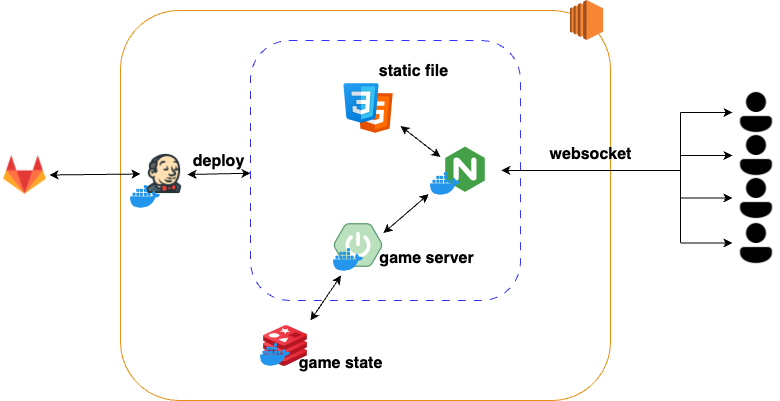

# OMG (Over the Money and Gold)

### Samsung Software Academy For Youth 11th - Specialization Project

> 2024.08.19 ~ 2024.10.16

---

1. [**Introduction**](#-introduction)
2. [**Tech Stack**](#-tech-stack)
3. [**Service Screens**](#-service-screens)
4. [**System Architecture**](#-system-architecture)
5. [**Contributors**](#-contributors)

 

## ✨ Introduction

---

### ✨ OMG: An Investment Strategy Game in a Christmas Village

Have you ever felt that learning about economics and finance is difficult and boring?

Have previous financial education games failed to capture your interest due to outdated design and rigid UI?

With OMG, you can intuitively and enjoyably learn economic concepts while playing!

#### 🌟 What Makes OMG Special

- **Modern and Engaging UI**: Unlike traditional finance games, OMG offers a sleek and attractive design.  
- **Learning Through Play**: Experience and understand economic concepts in a fun and interactive way.  
- **Tailored Content**: Optimized learning experiences for elementary and middle school students.  

#### 💡 Perfect For

- Students who want to learn economic concepts in a fun way  
- Parents who want to provide financial education to their children  
- Anyone who wants to gain practical knowledge through gameplay  

 

## 🔨 Tech Stack

---

**Back-end**: Java 21, Spring Boot 3.3.3, JPA, Gradle, MySQL, Redis, Elasticsearch, Logstash, Kibana, Filebeat, Kafka  
**Front-end**: React 18, Vite, TypeScript, Zustand, Axios, Tanstack Query, React Three Fiber, ESLint, Tailwind CSS  
**Infra**: Docker, NGINX, Jenkins  
**Tools**: Notion, GitLab, JIRA, Slack, Mattermost  

 

## 💻 Service Screens

---

### Create Room & Start Game
- The host creates a room, and once four players join, the **Start Game** button becomes active.

### Tutorial
- Provides guidance on basic controls and game rules.

### Player Interaction
- View other players’ positions via the minimap.  
- Monitor live trading activity.  
- Check nearby players’ real-time rankings when close to them.

### Loan & Repayment

### Stock Purchase
- Check remaining quantities and current prices of five different stocks.  
- Trade is limited by the maximum quantity based on the inflation level.  
- Upon purchase, both the stock price chart and ownership chart update in real time.  
- Purchased stocks are carried in a gift bag above the character’s head.  

### Stock Sale
- Review the stocks stored at home.  
- Trade is limited by the maximum quantity based on the inflation level.  
- Upon selling, both the stock price chart and ownership chart update in real time.  

### Gold Purchase

### Minimap

### Stock Price Fluctuations
- Stock selling raises the fluctuation gauge by 20% per action.  
- Stock buying or gold purchasing can also trigger fluctuations depending on internal logic.

### Coin Pickup
- Collect lucky coins by pressing the **space bar**.

### Visit Player’s House
- Each player starts at their own house.  
- Purchased stocks must be returned home before the round ends (penalty: cash decrease).  
- To sell stocks, players must retrieve them from their home.  
- Retrieved stocks are carried in the gift bag above the character’s head.

### Chatbot
- Toggle the chatbot icon in the bottom-right corner to ask for AI-powered investment advice.

### Round End & Loan Interest Update
- At the end of each round, interest is applied based on borrowed amounts and interest rates.

 

## 📊 System Architecture

---

 

## 👥 Contributors

---
- **Backend**: [@Kguswo](https://github.com/Kguswo), [@Celinemad](https://github.com/Celinemad), [@Gutsssssssssss](https://github.com/Gutsssssssssss)
- **Frontend**: [@hyun3745](https://github.com/hyun3745), [@hannabananah](https://github.com/hannabananah), [hi-react](https://github.com/hi-react)
- **Infrastructure & Deployment**: [@Gutsssssssssss](https://github.com/Gutsssssssssss)
